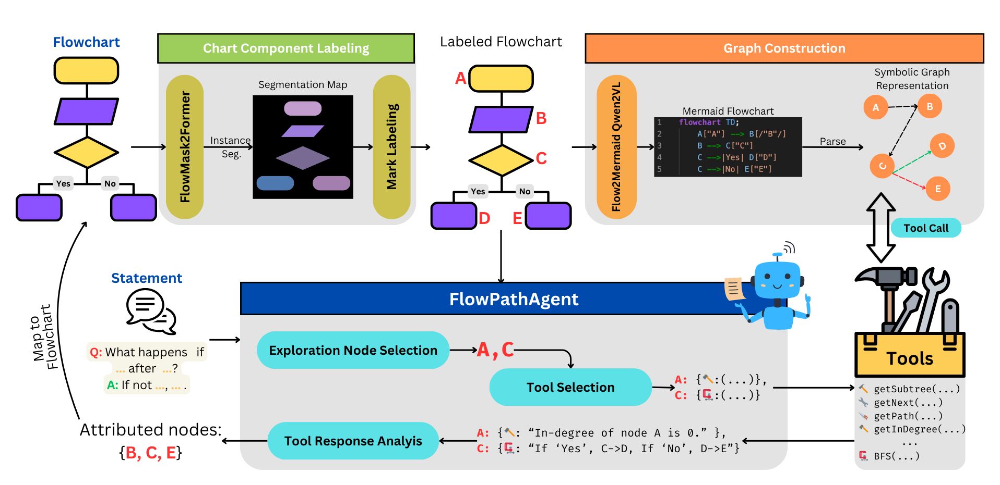

# Follow the Flow: Fine-grained Flowchart Attribution with Neurosymbolic Agents

Official code and dataset for the EMNLP 2025 paper, [Follow the Flow: Fine-grained Flowchart Attribution with Neurosymbolic Agents](https://aclanthology.org/2025.emnlp-main.1144/)




## Overview

Flowcharts are critical tools for visualizing decision-making processes. However, their non-linear structure and complex visual-textual relationships make it challenging to interpret them using LLMs. **FlowPathAgent** addresses this by performing fine-grained post hoc attribution through graph-based reasoning.

### Key Features

- **Neurosymbolic Approach**: Combines neural vision models with symbolic graph reasoning
- **Three-Stage Pipeline**:
  1. **Chart Component Labeling**: Instance segmentation + alphabetic labeling
  2. **Graph Construction**: Flowchart to Mermaid code conversion + parsing
  3. **FlowPathAgent**: Agentic reasoning with graph tools for attribution


## Installation

### Prerequisites

- Python 3.8+
- CUDA-compatible GPU (recommended for model inference)

### Setup

1. Clone this repository:
```bash
git clone https://github.com/MananSuri27/FollowTheFlow.git
cd FollowTheFlow
```

2. Install dependencies:
```bash
pip install -r requirements.txt
```

### Pre-trained Models & Datasets

Our pre-trained models and datasets are available on HuggingFace:

1. **FlowMask2Former** (Instance Segmentation):
   - Model: [`MananSuri27/finetune-instance-segmentation-flowchartseg-mask2former_20epochs_a6000`](https://huggingface.co/MananSuri27/finetune-instance-segmentation-flowchartseg-mask2former_20epochs_a6000)
   - Training Dataset: [`MananSuri27/flowchartseg`](https://huggingface.co/datasets/MananSuri27/flowchartseg)
   - Used in Chart Component Labeling stage

2. **Flow2MermaidQwen2VL** (Flowchart to Mermaid):
   - Training Dataset: [`MananSuri27/Flowchart2Mermaid`](https://huggingface.co/datasets/MananSuri27/Flowchart2Mermaid)
   - Used in Graph Construction stage

## Dataset: FlowExplainBench

**FlowExplainBench** is a novel benchmark for evaluating flowchart attributions across diverse styles, domains, and question types. The dataset includes:

- Flowchart images from multiple domains (code, wiki, instruction)
- Question-answer pairs with fine-grained node attributions
- Diverse question types: fact retrieval, reasoning, applied scenarios

The `data/dataset.json` file contains the benchmark with question-answer pairs and ground-truth attributions.

### Dataset Structure

The expected directory structure:

```
data/
├── dataset.json                # Question-answer pairs with attributions
└── images/                     # Flowchart images
    ├── code00001/
    │   ├── original.png        # Input flowchart image
    │   └── annotations.json    # Ground truth annotations
    ├── code00002/
    │   ├── original.png
    │   └── annotations.json
    └── ...
```

Each flowchart directory should contain:
- `original.png` and `flowchart.svg` - The raw flowchart image
- `annotations.json` - Ground truth annotations for evaluation (optional)

## Usage

The complete pipeline has three stages, all located in the `pipeline/` directory:

### 1. Chart Component Labeling

Segment flowchart components and add alphabetic labels:

```bash
python pipeline/seg_inference_scale.py
```

**What it does:**
- Loads FlowMask2Former model from HuggingFace
- Performs instance segmentation on flowcharts
- Renders alphabetic labels (A, B, C, ...) on each component
- Saves labeled images and bounding box coordinates

**Configuration:** Edit paths in `pipeline/seg_inference_scale.py`:
```python
input_directory = "./data/images"
```

### 2. Graph Construction

Convert labeled flowcharts to Mermaid code and symbolic graph representation:

```bash
python pipeline/flowchart2mermaid.py
```

**What it does:**
- Uses Flow2MermaidQwen2VL to generate Mermaid code
- Parses the code into a symbolic graph structure
- Saves mermaid code for each flowchart

**Configuration:** Edit paths in `pipeline/flowchart2mermaid.py`:
```python
process_directory("./data/images")
```

### 3. FlowPathAgent

Run the neurosymbolic agent for flowchart attribution:

```python
from pipeline.agents.chartpathagent import FlowPathAgent, main

# Configure paths
input_dir = "./data/images"
input_json = "./data/dataset.json"
output_dir = "./output/chartpathagent_run"

# Run the agent
agent = FlowPathAgent()
main(input_dir, input_json, output_dir, agent)
```


## Evaluation

Evaluate FlowPathAgent on the benchmark:

```bash
python evaluation/evaluate_agent.py
```

## Training

### Train Instance Segmentation Model (FlowMask2Former)

```bash
cd training/segmentation
python run_instance_segmentation.py
```

**Training Configuration:**
- Base model: `facebook/mask2former-swin-tiny-coco-instance`
- Dataset: `MananSuri27/flowchartseg`
- Fine-tuned for flowchart instance segmentation

Or use the training script:
```bash
bash train_seg.sh
```

### Fine-tune Qwen2-VL for Flowchart2Mermaid

```bash
cd training/flow2mermaid
python qwen2vl_sft.py
```

**Training Configuration:**
- Base model: `unsloth/Qwen2-VL-7B-Instruct`
- Dataset: `MananSuri27/Flowchart2Mermaid`
- LoRA fine-tuning with 4-bit quantization

## Repository Structure

```
FollowTheFlow/
├── pipeline/                    # Three-stage attribution pipeline
│   ├── seg_inference_scale.py  # Stage 1: Chart Component Labeling
│   ├── flowchart2mermaid.py    # Stage 2: Graph Construction
│   └── agents/                  # Stage 3: FlowPathAgent
│       ├── chartpathagent.py   # Main agent with agentic reasoning
│       ├── flowchart.py        # Graph structure and tools
│       └── prompt_template.py  # Agent prompts
├── evaluation/                  # Evaluation scripts
│   ├── evaluate_agent.py       # Evaluate FlowPathAgent
│   └── evaluate_baselines.py   # Evaluation utilities
├── training/                    # Training scripts (optional)
│   ├── segmentation/           # FlowMask2Former training
│   │   ├── run_instance_segmentation.py
│   │   └── train_seg.sh
│   └── flow2mermaid/           # Flow2MermaidQwen2VL training
│       ├── qwen2vl_sft.py
│       └── qwen2vl_inference.py
├── data/                        # Dataset
│   ├── dataset.json            # Questions and ground truth
│   └── images/                 # Flowchart images
├── assets/                      # Images and figures
│   └── main_figure.png
├── requirements.txt             # Dependencies
└── README.md                    # This file
```


## Citation

```bibtex
@inproceedings{suri-etal-2025-follow,
    title = "Follow the Flow: Fine-grained Flowchart Attribution with Neurosymbolic Agents",
    author = "Suri, Manan  and
      Mathur, Puneet  and
      Lipka, Nedim  and
      Dernoncourt, Franck  and
      Rossi, Ryan A.  and
      Gupta, Vivek  and
      Manocha, Dinesh",
    booktitle = "Proceedings of the 2025 Conference on Empirical Methods in Natural Language Processing",
    month = nov,
    year = "2025",
    address = "Suzhou, China",
    publisher = "Association for Computational Linguistics",
    url = "https://aclanthology.org/2025.emnlp-main.1144/",
    pages = "22496--22519",
    ISBN = "979-8-89176-332-6"
}
```